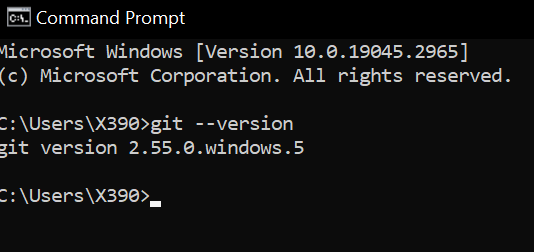
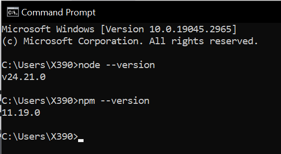
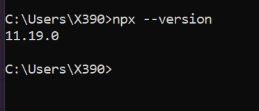
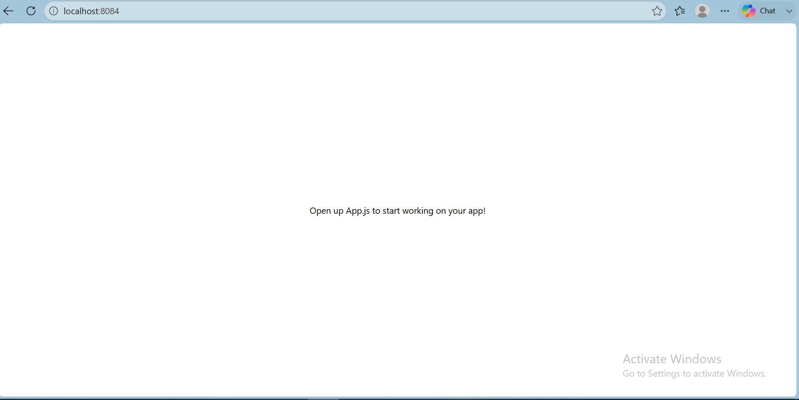
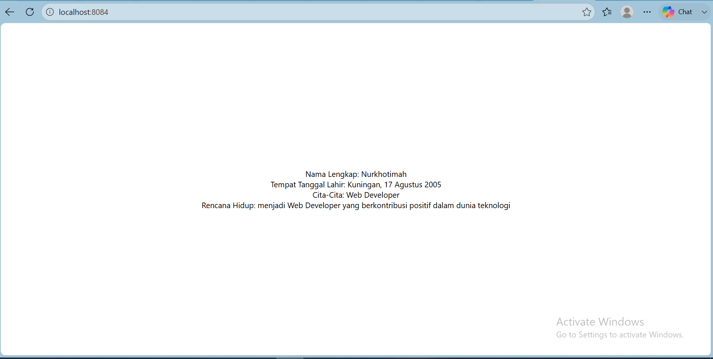

## **Praktikum Mentiapkan Memulai Pemrograman Mobile dengan React Native**
## **Tujuan Pembelajaran**
Setelah menyelesaikan modul praktikum ini, mahasiswa diharapkan mampu:
- Menginstal Git dan Github
- Menginstal Node JS dan NPM
- Menginstal Expo CLI
- Membuat project React Native
- Menjalankan project react Native

1. Install Git di Local
    - unduh dan instal Git via https://github.com/nur545315-oss/Mata_Kuliah_SMT5.git
    - Verifikasi Git (buka cmd dan ketik "git --version")
    

2. Instll Node JS
    - unduh dan instal Node JS via https://nodejs.org/en/download
    - Verifikasi Node JS (buka cmd dan ketik "node --version") 
    

3. Memulai Project dengan Framework Expo
    - Buka terminal pada code editor
    - Pastikan aktif di directory yang dituju
    - Ketikan (npx create-expo-app ptmn2 --template blank)
    - Tunggu hingga proses install selesai
    - Projek selesai 
    

4. Menjalankan Project React Native
    - Masuk ke directory project (cd ptmn2)
    - Jalankan project (npx expo start)
    - Scan QR Code dengan Aplikasi Expo Go
    - Jika ingin run emulator  di WEB ketik w
    - Di terminal "npx expo install react-dom react-native-web"
    - npx expo start --web
    

 5. LATIHAN PERTEMUAN-2
    - Tambahkan text berupa:
    - Nama Lengkap
    - Tempat Tanggal Lahir
    - Cita-Cita
    - Rencana Hidup
    